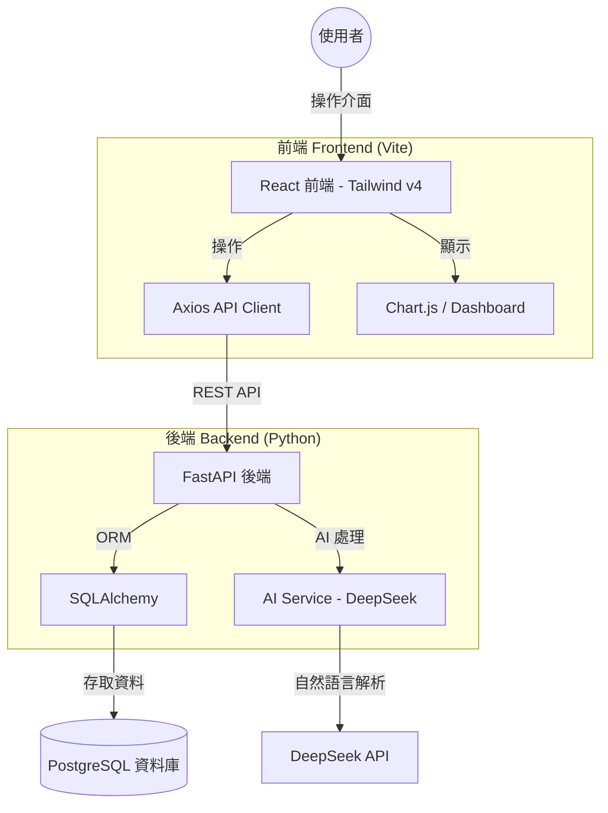
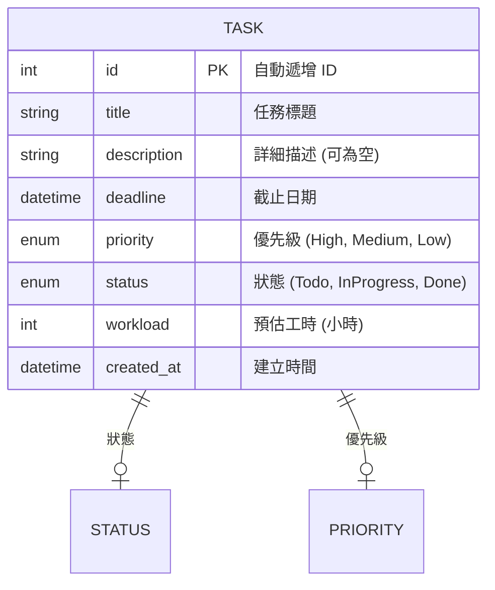
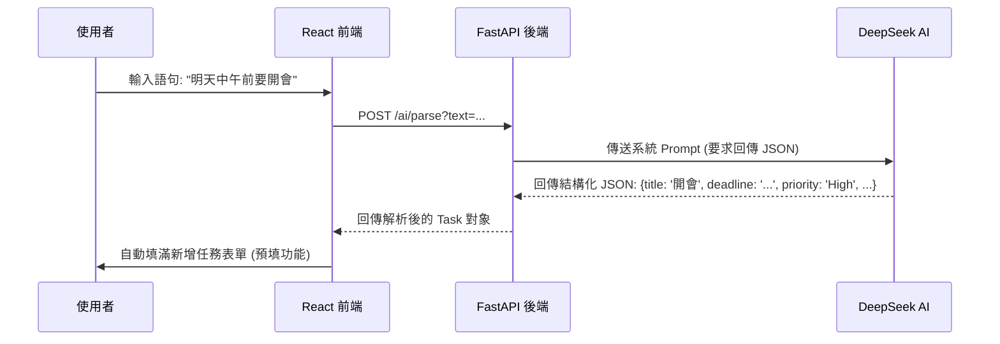
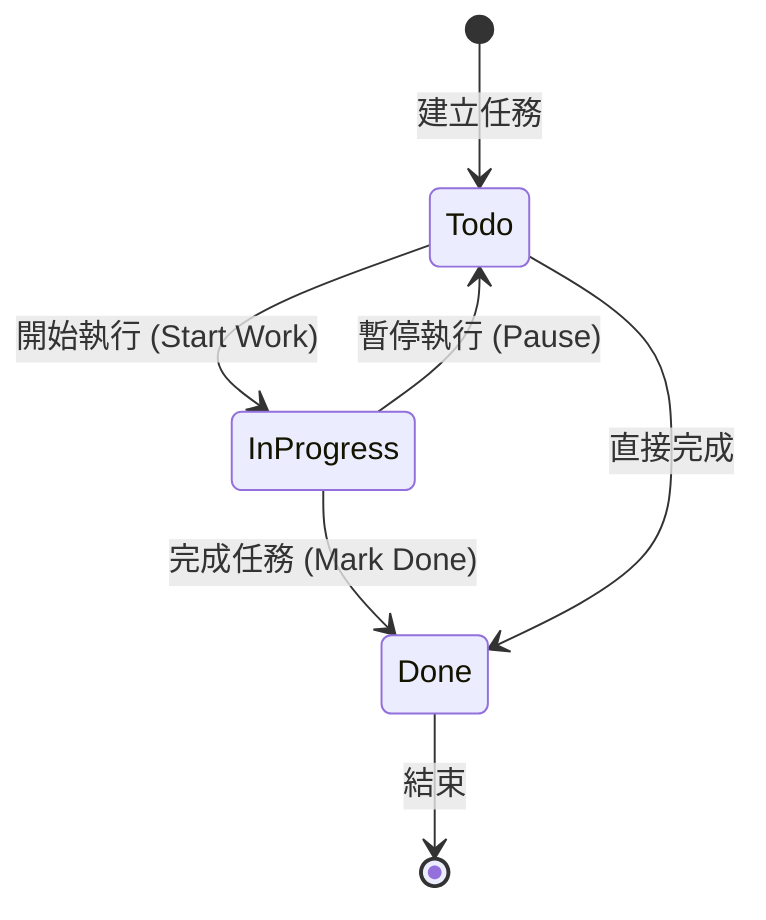

# AI 任務管理器 (AI Task Manager) - 系統規劃文件

本文件詳細描述了 **AI Task Manager** 的系統架構、資料流向以及模組設計。

---

## 1. 系統整體架構圖 (System Architecture)
這張圖展示了使用者如何透過前端與後端互動，以及後端如何連結資料庫與 AI 引擎。

---

## 2. 資料庫實體關係圖 (Entity-Relationship Diagram)
展示資料庫中 `tasks` 資料表的具體欄位設計與屬性。

---

## 3. 核心功能流程圖 (Feature Workflows)

### 3.1 AI 自然語言解析流程
當使用者輸入自然語言時，系統如何將其轉換為結構化任務。

### 3.2 任務狀態生命週期
展示一個任務從建立到完成的狀態轉變過程。

---

## 4. 系統模組地圖 (Module Map)
專案的功能模組分層設計。

*   **後端模組 (Backend Layer)**:
    *   `Database Module`: 處理 SQLAlchemy 與 PostgreSQL 連線。
    *   `Models Module`: 定義任務的資料結構。
    *   `AI Service`: 整合 DeepSeek API，處理 Parsing, Sorting, Summary。
    *   `API Endpoints`: 提供前端呼叫的 REST 接口。

*   **前端模組 (Frontend Layer)**:
    *   `Task Management`: 提供 CRUD 操作介面。
    *   `AI Assistant`: 整合語音/文字解析按鈕。
    *   `Visual Dashboard`: 使用 Chart.js 呈現任務分佈與工作量。
    *   `Responsive Layout`: 支援各類螢幕尺寸的響應式設計。

---

## 5. 未來擴充規劃 (Future Roadmap)
*   [ ] **使用者認證 (Auth)**: 支援 Google 帳號登入。
*   [ ] **行事曆同步 (Calendar Sync)**: 與 Google Calendar 連動。
*   [ ] **備用 AI 模型 (Gemini)**: 支援 Google Gemini API 作為備援方案。
*   [ ] **看板視圖 (Kanban Board)**: 拖拽式狀態管理。
