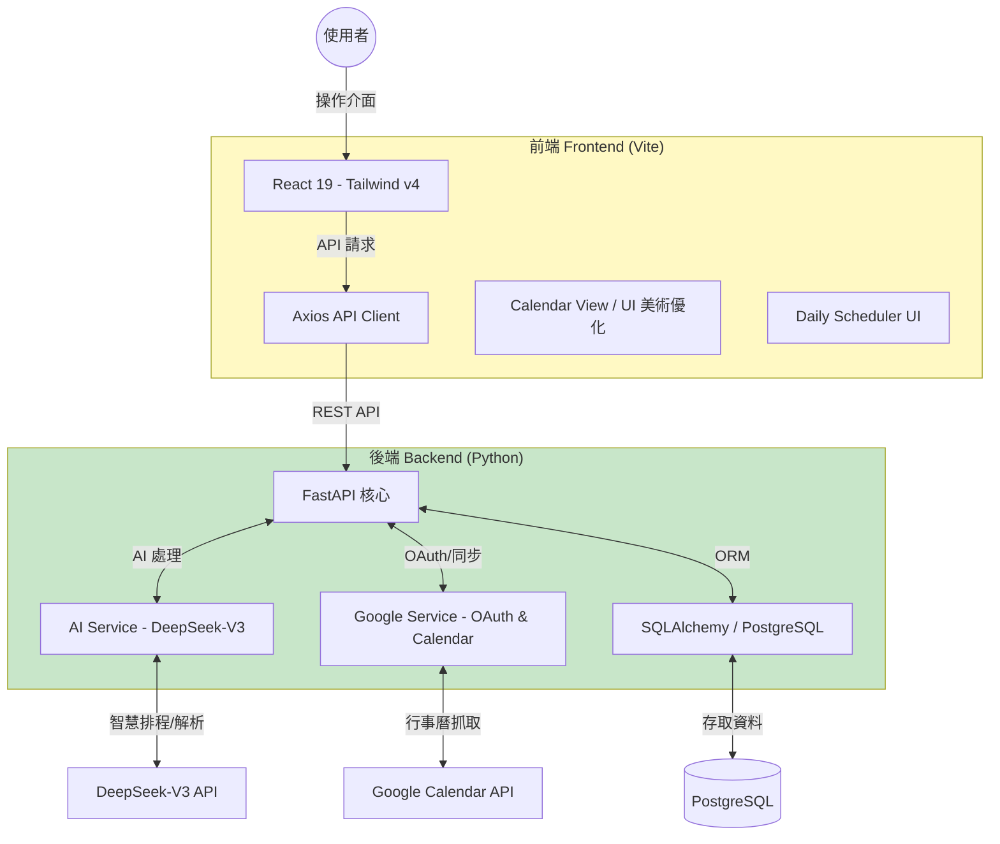
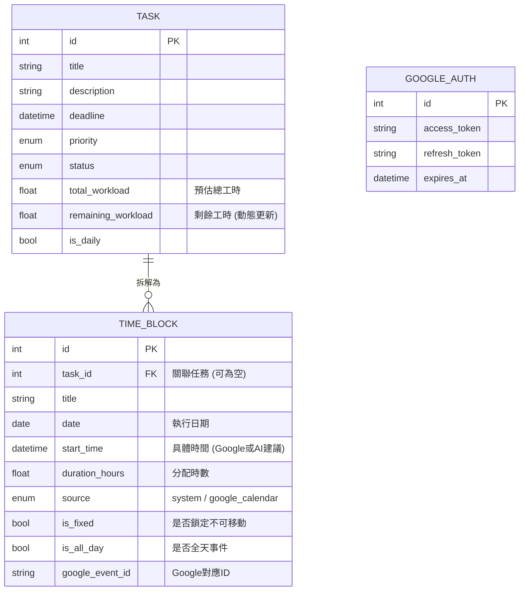
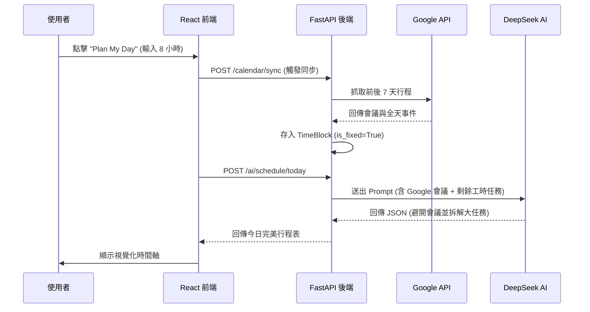
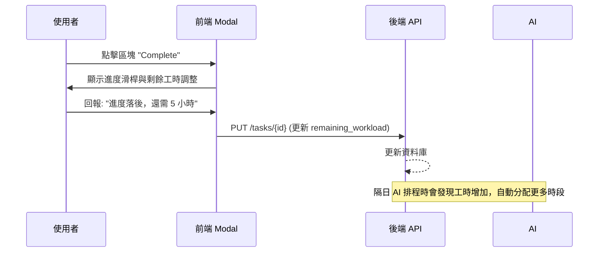

# TaskFlow AI - 系統規劃與架構文件

本文件詳細描述了 **TaskFlow AI** 的進階系統架構、資料關係以及核心工作流設計。

---

## 1. 系統整體架構圖 (System Architecture)
展示了 AI 專案經理如何整合任務資料、Google Calendar 外部資訊，並透過 DeepSeek 進行智慧排程。

---

## 2. 資料庫實體關係圖 (Entity-Relationship Diagram)
描述母專案任務與具體時間執行區塊（TimeBlock）的一對多關係，以及授權資訊儲存。

---

## 3. 核心功能流程圖 (Feature Workflows)

### 3.1 AI 智慧每日排程 (Daily Scheduling)
結合 Google Calendar 的固定行程與資料庫的彈性任務，動態分配時間。

### 3.2 量化回報與動態調整 (Feedback Loop)
執行完任務後的數據回饋，這將影響隔日的 AI 判斷。

---

## 4. 系統模組地圖 (Module Map)

*   **後端模組**:
    *   `Google Service`: 處理 OAuth 2.0 授權、Token 刷新與日曆資料解析。
    *   `AI Prompt Engine`: 基於外部 `daily_scheduler.md` (類 skill.md) 的提示詞管理。
    *   `Database Engine`: 處理 Task 與 TimeBlock 的連動與 Cascade 刪除。

*   **前端模組**:
    *   `Calendar Engine`: 高美術質感的月曆渲染與資料分發。
    *   `Schedule Controller`: 負責控制每日排程的生成、執行狀態切換與回報視窗。
    *   `Feedback Loop Component`: 處理量化數據的互動收集。

---

## 5. 開發進度與路徑 (Roadmap)
*   [x] **AI 任務解析與基本 CRUD**
*   [x] **量化剩餘工時系統**
*   [x] **Google Calendar 單向同步 (One-Way Sync)**
*   [x] **AI 動態時間阻斷排程 (Time Blocking)**
*   [x] **美術與 UI 大翻修**
*   [ ] **Google Calendar 雙向同步 (Push to GCal)**
*   [ ] **Kanban Board 看板視圖**
*   [ ] **多語系 (i18n) 完整支援**
